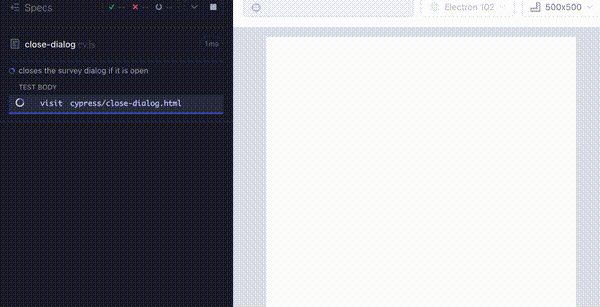
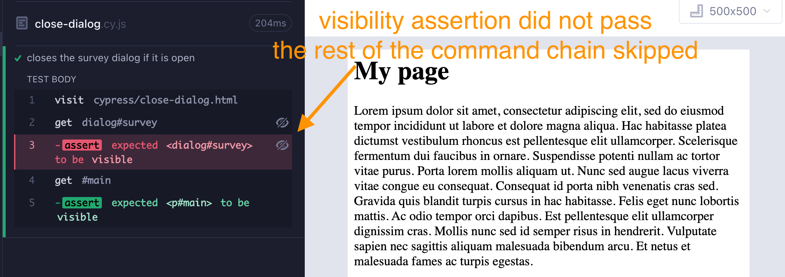
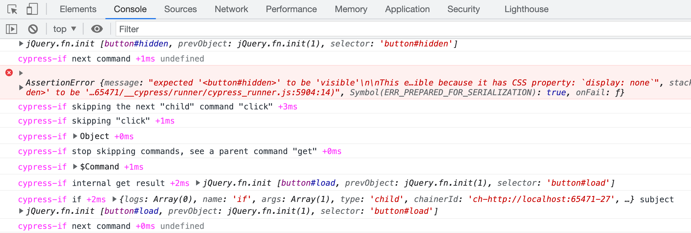

# cypress-if  [](https://github.com/bahmutov/cypress-if/actions/workflows/ci.yml)

> Easy conditional if-else logic for your Cypress tests

Tested with `cy.get`, `cy.contains`, `cy.find`, `.then`, `.within` commands in Cypress v9 and v10+.

- 📝 [Conditional Commands For Cypress](https://glebbahmutov.com/blog/cypress-if/)
- 📺 [Introduction To Using cypress-if Plugin to Write Conditional Cypress Commands](https://youtu.be/TVwU0OvrVUA)
- 📺 [Confirm Cypress Command Execution Order Using Sinon.js Spies](https://youtu.be/RTzJu44yAc8)
- 🎓 Covered in my [Cypress Plugins course](https://cypress.tips/courses/cypress-plugins)

## ⚠️ Warning

In general, Cypress team considers [conditional testing an anti-pattern](https://on.cypress.io/conditional-testing). Thus `cypress-if` should be used only if the test really cannot deterministically execute its steps.

## No xpath support

This plugin works by overriding `cy.get`, `cy.find`, and some other Cypress commands. It does NOT override the [cy.xpath](https://www.npmjs.com/package/@cypress/xpath) commands that comes from another plugin. I personally suggest never using `xpath` selectors (and I wrote `cy.xpath`), the jQuery selectors included with Cypress are much more powerful and less prone to breaking. Learn them using [cypress-examples](https://glebbahmutov.com/cypress-examples).

## Install

Add this package as a dev dependency

```
$ npm i -D cypress-if
# or using Yarn
$ yarn add -D cypress-if
```

Include this package in your spec or support file

```js
import 'cypress-if'
```

### Types

Types for the `.if()` and `.else()` commands are described in the include typescript file [src/index.d.ts](./src/index.d.ts) file. If you need intellisense, include the type for this package. For example,

```js
// your spec file
/// <reference types="cypress-if" />
```

If it does not work, and TS still complains about unknown command `.if`, then do the following trick and move on:

```js
cy.get(...)
  // @ts-ignore
  .if()
```

## Use

Let's say, there is a dialog that might sometimes be visible when you visit the page. You can close it by finding it using the [cy.get](https://on.cypress.io/get) command follows by the `.if()` command. If the dialog really exists, then all commands chained after `.if()` run. If the dialog is not found, then the rest of the chain is skipped.

```js
cy.get('dialog#survey').if().contains('button', 'Close').click()
```



## Assertions

By default, the `.if()` command just checks the existence of the element returned by the `cy.get` command. You might use instead a different assertion, like close a dialog if it is visible:

```js
cy.get('dialog#survey').if('visible').contains('button', 'Close').click()
```

If the dialog was invisible, the visibility assertion fails, and the rest of the commands was skipped



You can use assertions with arguments

```js
cy.wrap(42).if('equal', 42)...
```

You can use assertions with `not`

```js
cy.get('#enrolled').if('not.checked').check()
```

### Callback function

You can check the value yourself by writing a callback function, similar to the [should(callback)](http://on.cypress.io/should#Function) and its [many examples](https://glebbahmutov.com/cypress-examples/commands/assertions.html). You can use predicate and Chai assertions, but you **cannot use any Cypress commands inside the callback**, since it only synchronously checks the given value.

```js
// predicate function returning a boolean
const isEven = (n) => n % 2 === 0
cy.wrap(42).if(isEven).log('even').else().log('odd')
// a function using Chai assertions
const is42 = (n) => expect(n).to.equal(42)
cy.wrap(42).if(is42).log('42!').else().log('some other number')
```

For more examples, see the [cypress/e2e/callback.cy.js](./cypress/e2e/callback.cy.js) spec

### Combining assertions

If you want to right complex assertions that combine other checks using AND, OR connectors, please use a callback function.

```js
// AND predicate using &&
cy.wrap(42).if((n) => n > 20 && n < 50)
// AND connector using Chai "and" connector
cy.wrap(42).if((n) => expect(n).to.be.greaterThan(20).and.to.be.lessThan(50))
// OR predicate using ||
cy.wrap(42).if((n) => n > 20 || n < 10)
```

Unfortunately, there is no Chai OR connector.

For more examples, see the [cypress/e2e/and-or.cy.js](./cypress/e2e/and-or.cy.js) spec file

## else command

You can chain `.else()` command that is only executed if the `.if()` is skipped.

```js
cy.contains('Accept cookies')
  .if('visible')
  .click()
  .else()
  .log('no cookie banner')
```

The subject from the `.if()` command will be passed to the `.else()` chain, this allows you to work with the original element:

```js
cy.get('#enrolled')
  .if('checked')
  .log('**already enrolled**')
  // the checkbox should be passed into .else()
  .else()
  .check()
```

## Multiple commands

Sometimes it makes sense to place the "if" or "else" commands into `.then()` block

```js
cy.get('#survey')
  .if('visible')
  .then(() => {
    cy.log('closing the survey')
    cy.contains('button', 'Close').click()
  })
  .else()
  .then(() => {
    cy.log('Already closed')
  })
```

## Within

You can attach `.within()` command to the `.if()`

```js
cy.get('#survey')
  .if('visible')
  .within(() => {
    // fill the survey
    // click the submit button
  })
```

## finally

You might want to finish if/else command chains and continue afterwards. This is the purpose for the `.finally()` child command:

```js
cy.get('#agreed')
  .if('not.checked')
  .check()
  .else()
  .log('already checked')
  .finally()
  .should('be.checked')
```

`.finally` comes in useful when you are chaining something and don't want the "if/else" to "leak" to the next series of commands. From [#59](https://github.com/bahmutov/cypress-if/issues/59) comes the [issue-59.cy.js](./github/../cypress/e2e/issue-59.cy.js)

```js
function bar() {
  return (
    cy
      .wrap('testing')
      .if()
      .then(() => cy.wrap('got it'))
      .else()
      .then(() => cy.wrap('else do'))
      // to correctly STOP the chaining if/else
      // from putting anything chained of bar()
      // need to add .finally() command
      .finally()
  )
}
bar().then((it) => {
  cy.log(`result: ${it}`)
})
// logs:
// "testing"
// "got it"
// result: got it"
```

## cy.task

You can perform commands if the `cy.task` failed

```js
cy.task('throws').if('failed')
// handle the failure
```

## Aliases

You can have conditional commands depending on an alias that might exist.

```js
cy.get('@maybe')
  .if()
  // commands to execute if the alias "maybe" exists
  .else()
  // commands to execute if the alias "maybe" does not exist
  .finally()
  // commands to execute after
  .log(...)
```

See spec [alias.cy.js](./cypress/e2e/alias.cy.js)

## Null values

Typically `null` values are treated same as `undefined` and follow the "else" path. You can specifically check for `null` and `not.null` using these assertions:

```js
cy.wrap(null).if('null') // takes IF path
cy.wrap(null).if('not.null') // takes ELSE path
cy.wrap(42).if('not.null') // takes IF path
```

See spec [null.cy.js](./cypress/e2e/null.cy.js)

## raise

This plugin includes a utility custom command `cy.raise` that lets you conveniently throw an error.

```js
cy.get('li').if('not.have.length', 3).raise('Wrong number of todos')
```

**Tip:** the above syntax works, but you better pass an Error instance rather than a string to get the exact stack trace location

```js
cy.get('li').if('not.have.length', 3).raise(new Error('Wrong number of todos'))
```

## More examples

Check out the spec files in [cypress/e2e](./cypress/e2e/) folder. If you still have a question, [open a GitHub issue](https://github.com/bahmutov/cypress-if/issues).

## Debugging

This module uses [debug](https://github.com/debug-js/debug#readme) module to output verbose browser console messages when needed. To turn the logging on, open the browser's DevTools console and set the local storage entry:

```js
localStorage.debug = 'cypress-if'
```

If you re-run the tests, you should see the messages appear in the console



## See also

- [cypress-wait-if-happens](https://github.com/bahmutov/cypress-wait-if-happens)
- [cypress-ngx-ui-testing](https://github.com/swimlane/ngx-ui/tree/master/projects/swimlane/ngx-ui-testing)

## Small print

Author: Gleb Bahmutov &lt;gleb.bahmutov@gmail.com&gt; &copy; 2022

- [@bahmutov](https://twitter.com/bahmutov)
- [glebbahmutov.com](https://glebbahmutov.com)
- [blog](https://glebbahmutov.com/blog)
- [videos](https://www.youtube.com/glebbahmutov)
- [presentations](https://slides.com/bahmutov)
- [cypress.tips](https://cypress.tips)
- [Cypress Tips & Tricks Newsletter](https://cypresstips.substack.com/)
- [my Cypress courses](https://cypress.tips/courses)

License: MIT - do anything with the code, but don't blame me if it does not work.

Support: if you find any problems with this module, email / tweet /
[open issue](https://github.com/bahmutov/cypress-if/issues) on Github

## MIT License

Copyright (c) 2022 Gleb Bahmutov &lt;gleb.bahmutov@gmail.com&gt;

Permission is hereby granted, free of charge, to any person
obtaining a copy of this software and associated documentation
files (the "Software"), to deal in the Software without
restriction, including without limitation the rights to use,
copy, modify, merge, publish, distribute, sublicense, and/or sell
copies of the Software, and to permit persons to whom the
Software is furnished to do so, subject to the following
conditions:

The above copyright notice and this permission notice shall be
included in all copies or substantial portions of the Software.

THE SOFTWARE IS PROVIDED "AS IS", WITHOUT WARRANTY OF ANY KIND,
EXPRESS OR IMPLIED, INCLUDING BUT NOT LIMITED TO THE WARRANTIES
OF MERCHANTABILITY, FITNESS FOR A PARTICULAR PURPOSE AND
NONINFRINGEMENT. IN NO EVENT SHALL THE AUTHORS OR COPYRIGHT
HOLDERS BE LIABLE FOR ANY CLAIM, DAMAGES OR OTHER LIABILITY,
WHETHER IN AN ACTION OF CONTRACT, TORT OR OTHERWISE, ARISING
FROM, OUT OF OR IN CONNECTION WITH THE SOFTWARE OR THE USE OR
OTHER DEALINGS IN THE SOFTWARE.
